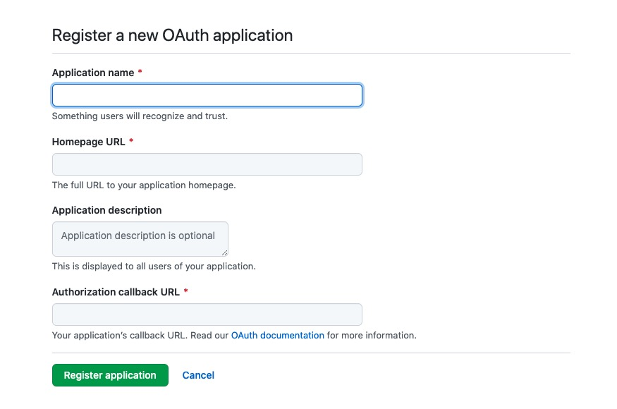

# 展示图片

1. 下面展示一张示例图片



2. 安装依赖包

```bash
yarn add -D @vuepress/plugin-medium-zoom
```

3. 修改 `.vuepress/config.js` 启用展示图片功能

```js
{
  plugins: {
    '@vuepress/medium-zoom': {
      selector: '.theme-default-content :not(a) > img', // 图片选择器
      options: {
        margin: 16, // 边距
        background: '#fff', // 背景色
        scrollOffset: 40, // 滚动距离取消展示
      },
    },
  },
}
```

## 参考内容

1. [vuepress plugin-medium-zoom](https://vuepress.vuejs.org/zh/plugin/official/plugin-medium-zoom.html)
2. [medium-zoom 官网](https://medium-zoom.francoischalifour.com/)
3. [medium-zoom github](https://github.com/francoischalifour/medium-zoom)
